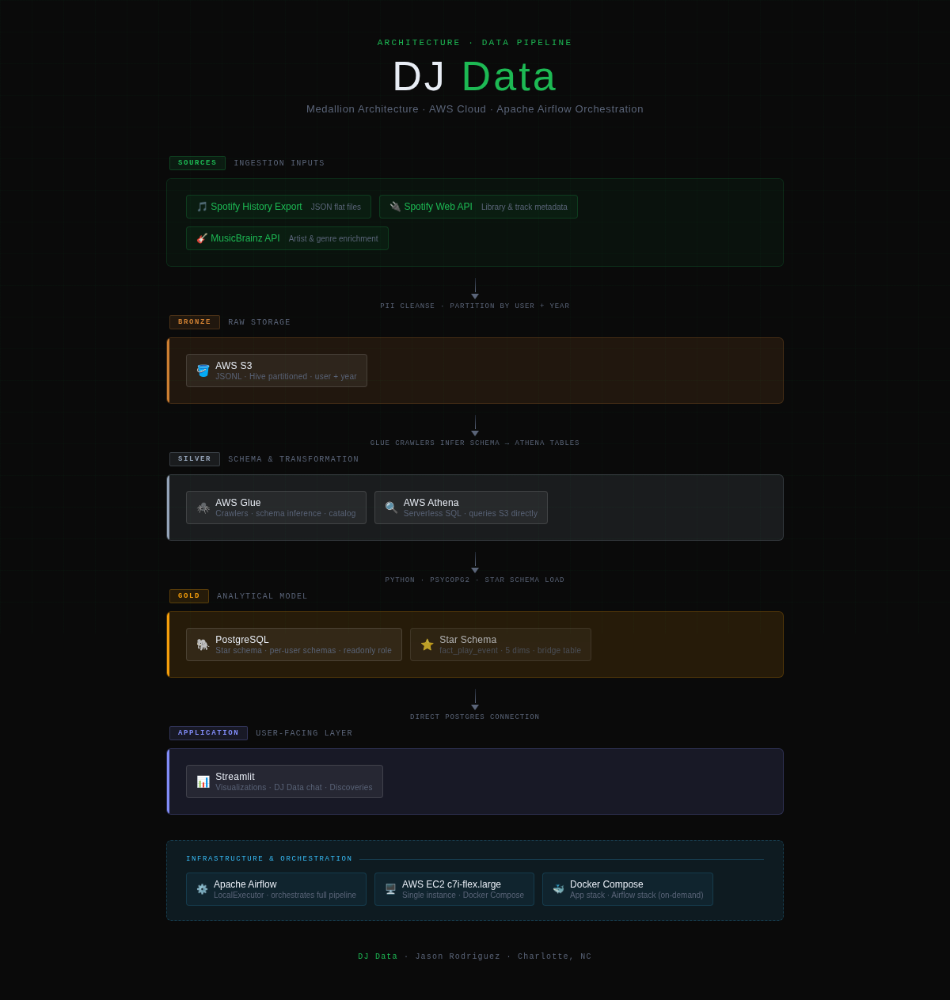
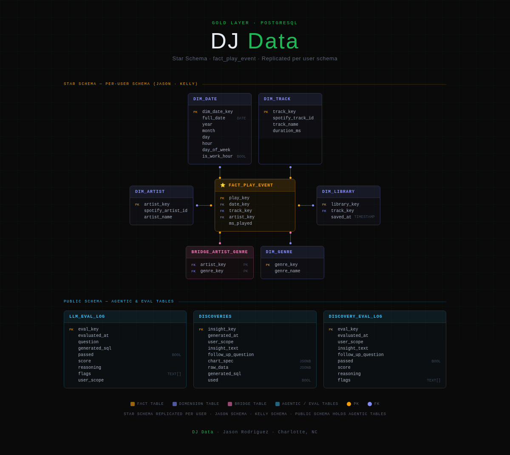
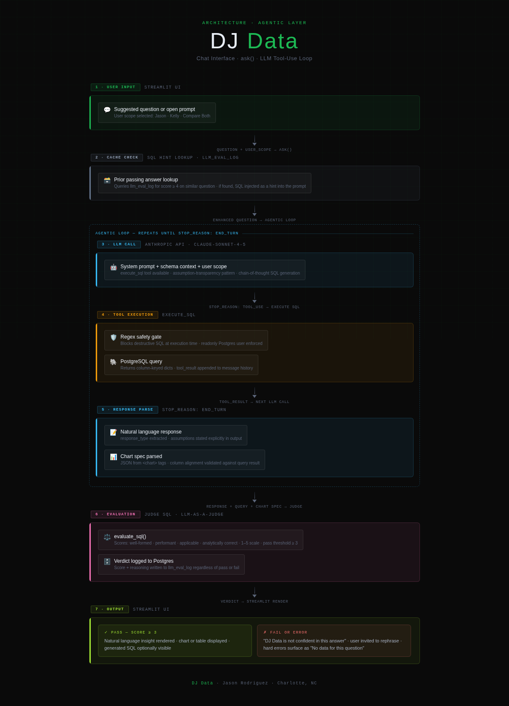
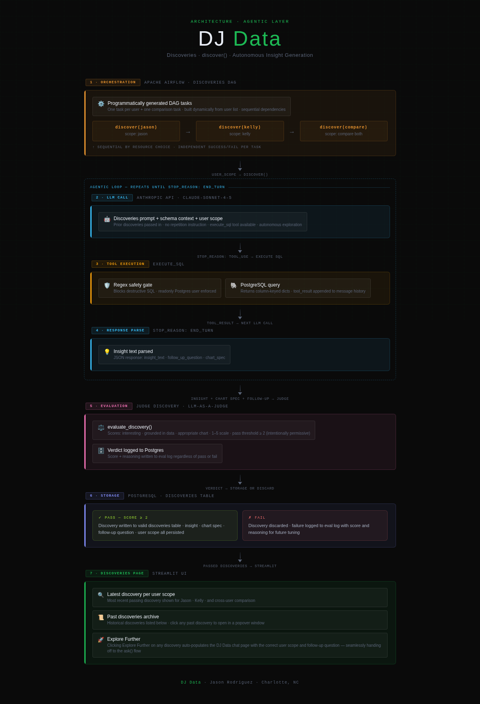

# DJ Data

> A personal Spotify analytics platform built from scratch over three months — a full modern data stack powered by a decade of real listening history, extended to two users, and driven by an agentic AI layer that thinks, queries, evaluates, and discovers.

[](https://www.youtube.com/watch?v=12h5bisPd_8)
*Click to watch a demo of the DJ Data platform*

---

## Table of Contents

- [Overview](#overview)
- [Architecture](#architecture)
- [Security](#security)
- [Feature Walkthrough](#feature-walkthrough)
- [Evolution of the Project](#evolution-of-the-project)
- [Technical Deep Dives](#technical-deep-dives)
- [Limitations and Known Issues](#limitations-and-known-issues)
- [Replication Guide](#replication-guide)
- [Learnings and Reflections](#learnings-and-reflections)
- [How Claude Was Used](#how-claude-was-used)

---

## Overview

What started as a personal ETL pipeline ended as a custom-built analytics dashboard with a three-tier LLM system that generates SQL, judges its own output, and autonomously surfaces insights neither user thought to look for.

This is my first personal project. I built it deliberately — writing the code myself, owning every architectural decision, every prompt engineering iteration, every debugging session. Building something real, in a domain I love, with tools that pushed me — that's what this project is.

---

## Architecture

A medallion architecture on AWS — raw data flows from S3 through Glue and Athena into a PostgreSQL star schema, orchestrated by Airflow and served through Streamlit, all running on a single EC2 instance.



### Bronze Layer — Raw Ingestion

Spotify history exports, Spotify API metadata, and MusicBrainz genre enrichment land in S3 — cleansed of PII and partitioned by user and year.

<details>
<summary>Dive deeper</summary>

The bronze layer is the entry point for all raw data. Spotify streaming history arrives as static JSON exports and is lightly cleansed to remove PII before landing in S3. The data is enriched with additional context from the Spotify API — primarily library and track metadata — and from MusicBrainz, an open music database used to fill the artist and genre relationships that Spotify deprecated from their API.

S3 was chosen for its native integration with Glue and Athena, its flexible partitioning model, and prior familiarity. As the project expanded to a second user, partitions were structured around users from the start — a decision that propagated cleanly through every downstream layer and made cross-user querying straightforward later on.

</details>

---

### Silver Layer — Schema & Transformation

Glue crawlers infer schemas from S3 JSONL and create Athena-queryable tables — no manual table scripts, S3 treated as source of truth.

<details>
<summary>Dive deeper</summary>

Glue crawlers crawl the S3 bronze data, infer schemas from stored JSONL files, and automatically create tables available for Athena querying — eliminating manual table creation scripts. Athena queries S3 directly through those tables, keeping the architecture lean.

Crawlers are run manually — a deliberate tradeoff to conserve AWS resources outside of active development. One practical challenge was **schema drift** — changes in the Spotify API's response structure occasionally required crawler reruns and schema adjustments, shaping how the bronze layer stored certain datasets as snapshots rather than appended records.

</details>

---

### Gold Layer — Analytical Model

Python extracts Athena query results and loads them into a PostgreSQL star schema — one fact table, five dimensions, a bridge table, and isolated per-user schemas.



<details>
<summary>Dive deeper</summary>

PostgreSQL was chosen deliberately for hands-on experience after a background primarily in Oracle. Data arrives via Python scripts that execute Athena queries and insert results into Postgres using psycopg2.

**Schema design:**
- `fact_play_event` — one row per discrete Spotify play event
- `dim_track`, `dim_artist`, `dim_date`, `dim_genre`, `dim_library` — surrounding dimensions
- `bridge_artist_genre` — handles the many-to-many artist ↔ genre relationship
- `dim_library` — captures whether a track is saved and when

**Multi-user design:** each user gets an isolated Postgres schema with the same table structure rather than a shared schema with a user column — cleaner permissioning, simpler querying, and a natural fit for the readonly access model built for the agentic layer.

</details>

---

### Orchestration — Apache Airflow

Full pipeline orchestration with explicit task dependencies, a boolean parameter for full vs. lightweight runs, and two separate Docker Compose stacks — pipeline on-demand, application always-running.

<details>
<summary>Dive deeper</summary>

**DAG structure:**
- Tasks for loading raw streaming history from flat files
- Individual tasks per dimension and fact table
- Explicit dependencies mirror dimensional load order — dims before facts

**Key parameters:**

| Parameter | Default | Purpose |
|---|---|---|
| `ingest_streaming_history` | `False` | Toggles full flat file reload vs. lighter run |
| `user` | `jason` | Scopes all tasks and S3 paths to a specific user |

**Why LocalExecutor?** Celery required Redis and a separate worker container with no real parallelism benefit. LocalExecutor freed meaningful resources and simplified the compose setup.

**Two Docker Compose stacks:** the application stack (Postgres + Streamlit) runs always-on. Airflow spins up on-demand only when pipeline runs are needed — keeping infrastructure lean and the two concerns cleanly separated.

</details>

---

### Application Layer — Streamlit

Three-page app: custom visualizations dashboard, agentic natural language chat interface, and an autonomous discoveries page — all querying Postgres directly.

<details>
<summary>Dive deeper</summary>

Streamlit was chosen for its clean aesthetic and fast iteration cycle, originally scoped to just the visualization page before naturally becoming the home for the agentic layer as the project expanded.

Streamlit connects directly to the PostgreSQL gold layer, keeping the application layer thin and the database as the single source of truth for both the dashboard and the AI-powered query interface.

</details>

---

### Infrastructure — AWS EC2

Full stack on a single `c7i-flex.large` — Docker Compose, EC2 User Data bootstrapping, local → GitHub → EC2 development workflow.

<details>
<summary>Dive deeper</summary>

Everything runs on one instance — Postgres, Streamlit, the MCP server, and Airflow — a deliberate simplicity choice that still delivers real infrastructure experience.

- **Dev workflow:** code written locally → pushed to GitHub → pulled on EC2. Never edited directly on the server.
- **EC2 User Data:** bootstraps the environment on a fresh instance, making the setup reproducible without manual configuration.
- **Instance:** `c7i-flex.large` balances cost and compute for a personal project workload.

</details>

---

## Security

Access is locked down at two layers — AWS IAM for cloud resources, and a dedicated readonly Postgres user for the agentic layer.

<details>
<summary>Dive deeper</summary>

#### AWS IAM — `spotify-data-pipeline-svc`

A dedicated service account with two least-privilege policies — no console access, no wildcard permissions.

**`SpotifyDataPipelineS3RWDev`** — scoped to a single bucket:
```
s3:ListBucket · s3:GetObject · s3:PutObject · s3:GetBucketLocation
Resource: arn:aws:s3:::<your-bucket-name>
```

**`SpotifyPipelineAthenaDev`** — query execution and catalog reads only:
```
athena:StartQueryExecution · GetQueryExecution · GetQueryResults · StopQueryExecution
glue:GetDatabase · GetTable · GetPartitions
```

No S3 delete permissions. No Athena DDL. No Glue write access. The service account can read, write, and query — nothing more.

---

#### PostgreSQL — `spotify_readonly`

A dedicated readonly Postgres user was created exclusively for the agentic layer. It has `SELECT`-only grants on the user schemas — no `INSERT`, `UPDATE`, `DELETE`, or DDL of any kind.

This ensures that even if the LLM generates destructive SQL, the database user cannot execute it — a second line of defense independent of the regex safety gate in `execute_sql`.

</details>

---

## Feature Walkthrough

### Visualizations

A decade of streaming history in one dashboard — KPIs, daily bar chart with drilldown, genre trends, library growth, listening streaks, streams by day of week, top ten tracks, annual hours, and an artist word cloud. Multi-user selector controls the full page.

<details>
<summary>Dive deeper</summary>

The visualizations page is the original core of DJ Data — a fully custom analytics dashboard built on a decade of personal streaming history.

**Included visualizations:**
- **KPI row** — top-level listening stats at a glance
- **Daily streaming bar chart** — click any bar to drill down into what was played that day and for how long
- **Yearly genre trends** — multi-genre overlay with filter for genre selection
- **Library growth** — tracks added to the library over time
- **Listening streaks** — longest consecutive days a track was streamed
- **Streams by day of week** — listening hours against each day
- **Top 10 most played tracks**
- **Annual streaming hours**
- **Artist word cloud**

Genre gaps from MusicBrainz are acknowledged directly on the page — a transparency decision rather than a silent omission.

</details>

---

### DJ Data — Chat Interface

Natural language to SQL — ask questions about your listening history in plain English, get answers with charts. Confidence-aware: the eval layer surfaces when it isn't sure.



<details>
<summary>Dive deeper</summary>

The DJ Data page is the agentic analytics layer — a natural language interface for querying a decade of streaming data without writing SQL.

- **User scope selector** — Jason · Kelly · Compare Both
- **Six suggested questions** — curated jumping-off points for exploration
- **Open prompt** — freeform question input
- **Assumption transparency** — the model states its assumptions explicitly rather than asking clarifying questions
- **Confidence-aware output** — failed eval verdicts surface gracefully with an invitation to rephrase
- **Out-of-scope handling** — questions outside the database are declined, not hallucinated

**`ask()` — Input / Output**

| | |
|---|---|
| **Input** | `question` · `user_scope` |
| **Output** | `raw_data` · `natural_language_response` · `chart_spec` · `generated_sql` · `verdict` · `response_type` |

</details>

---

### Discoveries

An Airflow DAG lets Claude autonomously explore the database and surface insights nobody asked for — one per user, one cross-user comparison. Explore Further hands off directly to the chat interface.



<details>
<summary>Dive deeper</summary>

The Discoveries page is the most agentic part of the project — unprompted, exploratory, driven entirely by what the data contains.

- **Latest discovery** shown per user scope (Jason · Kelly · Compare Both)
- **Past discoveries archive** — full history below the latest, click any to open in a popover
- **Explore Further** — auto-populates the DJ Data chat page with the correct scope and follow-up question, handing off seamlessly to the ask flow
- **Judge-filtered** — only discoveries that pass the evaluation layer reach the page

**`discover()` — Input / Output**

| | |
|---|---|
| **Input** | `user_scope` |
| **Output** | `insight_text` · `follow_up_question` · `chart_spec` · `user_scope` |

</details>

---

## Evolution of the Project

From a simple ETL idea to a full agentic analytics platform — shaped by real constraints, API changes, and expanding ambition at every step.

<details>
<summary>Dive deeper</summary>

| Phase | What Changed | Why |
|---|---|---|
| Initial scope | Global playlist analysis → personal library only | Spotify API scope limitations |
| Enrichment | Added MusicBrainz genre data | Spotify deprecated artist/genre fields |
| Partitioning | Refined S3 partition strategy per dataset | Saved tracks → truncate/reload · streaming history → year partitions |
| Multi-user | Extended pipeline, schema, and queries to a second user | Real mid-project requirement change touching every layer |
| Infrastructure | Local Docker → AWS EC2 | WSL memory limits under Airflow + Postgres |
| Agentic layer | Added natural language interface, eval layer, discoveries DAG | Wanted to explore LLM integration with real data |
| Landing page | Added public HTML landing page | Portfolio presentation and project closure |

**The six original questions** that started it all:
1. Top 10 most time-listened tracks of all time
2. Listening history over time by genre
3. Top 10 tracks played during work hours
4. Total listening time per year
5. Saved library tracks never played
6. Longest consecutive listening streak by track

*Those six were the spark — not the final scope.*

</details>

---

## Technical Deep Dives

### Prompt Engineering

Three distinct prompts — system, judge, and discoveries — each structured with explicit roles, schema context, and an assumption-transparency pattern that states reasoning rather than asking clarifying questions.

<details>
<summary>Dive deeper</summary>

#### System Prompt
Accepts `user_scope` as a parameter. Opens with behavioral instructions scoped to that user, defines the agent's role, and specifies the full response format — natural language insight, SQL query, and chart specification with explicit guidelines for each.

#### Judge SQL Prompt
Defines an evaluator role explicitly told it is judging output from another LLM call. Receives the original question, generated SQL, and natural language response. Scores on a **1–5 rubric** — pass threshold ≥ 3 — across:
- Well-formed SQL
- Query performance
- Applicability to the question
- Analytical correctness

#### Discoveries Prompt
Accepts `user_scope` and full schema context. Passes in prior discoveries to prevent repetition. Defines an autonomous exploration role with detailed instructions for response format, chart spec, and query structure.

---

**Assumption-transparency pattern** — rather than asking clarifying questions upfront, the model states its assumptions explicitly (e.g. *"I'm interpreting 'recent' as the last 90 days"*). This keeps the UI clean, tests the model's reasoning directly, and produces a more honest user experience than a clarification loop.

> The most surprising part: small changes in phrasing, instruction ordering, and context specificity produced meaningfully different output. Prompt engineering at this level is a real discipline.

</details>

---

### Eval Layer

LLM-as-a-Judge for both SQL quality and discovery interestingness — structured verdicts, Postgres logging, and a regex safety gate at execution time independent of the eval flow.

<details>
<summary>Dive deeper</summary>

#### Judge SQL
- **Input:** question · user scope · generated SQL · natural language response
- **Evaluates:** well-formed · performant · applicable · analytically correct
- **Scoring:** 1–5 · pass ≥ 3
- **Output:** structured verdict dict → logged to `llm_eval_log`

#### Judge Discovery
- **Input:** insight text · follow-up question · chart spec · user scope
- **Evaluates:** interesting · grounded in data · appropriate chart
- **Scoring:** 1–5 · pass ≥ 2 *(intentionally permissive — threshold designed to increase over time)*
- **Output:** structured verdict dict → logged to `discovery_eval_log`

#### Safety Gate
A **regex check in `execute_sql`** blocks destructive SQL at execution time — independent of the eval layer. Data integrity enforcement and quality evaluation are deliberately separated concerns.

#### Verdict flow
- ✅ **Pass** → result rendered in Streamlit
- ❌ **Fail** → graceful user-facing message · verdict still logged with score and reasoning

</details>

---

### Error Handling

Graceful failure at every layer — distinct user-facing messages for failed verdicts vs. hard errors, Airflow retries, and verdict logging to Postgres.

<details>
<summary>Dive deeper</summary>

| Failure type | User sees | Behind the scenes |
|---|---|---|
| Hard error (token limit, execution failure) | "No data for this question" | Logged via `get_logger` |
| Failed judge verdict | "DJ Data is not confident in this answer" | Verdict logged to Postgres with score + reasoning |
| Out-of-scope question | Graceful decline | Handled by response_type parsing |

- All Anthropic API calls wrapped in **try/except**
- Airflow DAG tasks have **retry logic with wait gaps** for transient failures
- Both pipeline and discoveries DAGs have **thorough task-level logging** visible in the Airflow UI
- *Known gap:* token limit errors and genuinely empty results currently return the same user message — more granular classification is a future improvement

</details>

---

## Limitations and Known Issues

- **Error messaging granularity** — Token limit errors and hard failures surface the same message. More specific classification is a future improvement.
- **Data freshness** — No explicit freshness indicator on the dashboard. Future: surface in UI, potentially allow agentic layer to trigger pipeline runs.
- **Saved tracks / streaming history gap** — Tracks streamed but never saved may have incomplete metadata and genre gaps.
- **Genre coverage** — MusicBrainz coverage is incomplete for some artists. Gaps are acknowledged on the dashboard.
- **Manual Glue crawler runs** — Schema changes require a manual rerun by design.
- **Landing page / Streamlit navigation** — Functional but not seamless across the static/Streamlit boundary.

---

## Replication Guide

### Prerequisites
- AWS account with EC2 and S3 access
- Spotify Developer credentials per user
- Anthropic API credentials
- Docker and Docker Compose
- Python dependencies per `requirements.txt`

### Steps

1. Clone the repository locally and on your EC2 instance
2. Configure Spotify Developer credentials for each user
3. Add your Anthropic API key to the environment configuration
4. Set up AWS credentials and configure your S3 bucket and EC2 instance
5. Configure environment variables and `config.yaml` per the provided templates
6. Spin up the application stack with `make up` and Airflow with `make airflow-up` when needed
7. Run Glue crawlers to build the silver layer tables after initial S3 loads
8. Trigger the Airflow DAG for an initial full pipeline run to populate the gold layer
9. Access Streamlit via SSH tunnel:

```bash
ssh -L 8501:localhost:8501 ec2-user@<your-ec2-ip>
```

> **Note** — Built and tested on a single EC2 `c7i-flex.large`. Resource requirements for other instance types have not been tested.

---

## Learnings and Reflections

End-to-end ownership of a real project is the best teacher. The LLM layer was the biggest surprise — prompt engineering at production depth is a genuine discipline. Scope creep was real, and learning when to ship was its own skill.

*The ending state of the project is impressive considering where it started. That matters.*

<details>
<summary>Dive deeper</summary>

**What landed:**
- Touching every phase of a modern data pipeline — ingestion, transformation, modeling, orchestration, infrastructure, application, and agentic AI — in one project
- Deliberate curiosity about *why* at each design decision, not just *what*
- Firsthand understanding that working with LLMs as engineering components is a different discipline than using them as chat tools

**What surprised me:**
- How much prompt specificity and instruction ordering affected LLM output quality
- The quality of insights the model surfaced autonomously — discoveries neither user thought to ask for
- How real constraints (Spotify API changes, memory limits, scope creep) shaped better decisions than unlimited resources might have

**What I'd do differently:**
- More user testing beyond personal use — the project was always functional but outside perspectives would have sharpened it earlier

**Personal lessons:**
- Perfectionism and scope creep are real forces — naming them helped manage them
- Building in a domain you care about makes the hard parts worth pushing through
- Learning by doing is the only way that actually sticks

</details>

---

## How Claude Was Used

Claude played multiple roles throughout the build — design partner, code reviewer, scope manager, and documentation collaborator. In the running application, Claude is the runtime engine powering SQL generation, evaluation, and autonomous discovery.

**Estimated code ownership: ~75–80% written independently.** Claude guided and reviewed — it didn't implement.

<details>
<summary>Dive deeper</summary>

**During the build, Claude served as:**
- 🏗️ **Design partner** — architectural decisions and tradeoff discussions before writing code
- 🔍 **Code reviewer** — catching issues, suggesting improvements, explaining behaviors
- 🎯 **Scope manager** — calling out scope creep and keeping the project grounded
- 💡 **Idea validator** — pressure-testing approaches before committing to them
- 📝 **Documentation collaborator** — the thinking and substance is the author's; the shaping and polish was Claude's

**Ground rule throughout:** Claude was explicitly instructed to guide and review rather than implement. Understanding checks were built into the process — every piece of code was owned and explainable, not just functional.

**In the running application, Claude is the runtime:**
- Natural language → SQL generation via the Anthropic API
- LLM-as-a-Judge evaluation layer
- Autonomous discoveries DAG

> Claude as a build tool and Claude as a production component are two distinct relationships. DJ Data demonstrates both.

</details>

---

*Built by Jason Rodriguez · Charlotte, NC*
